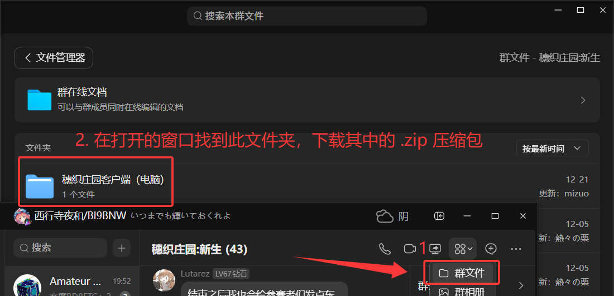
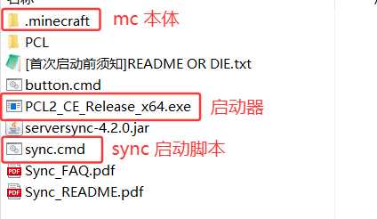
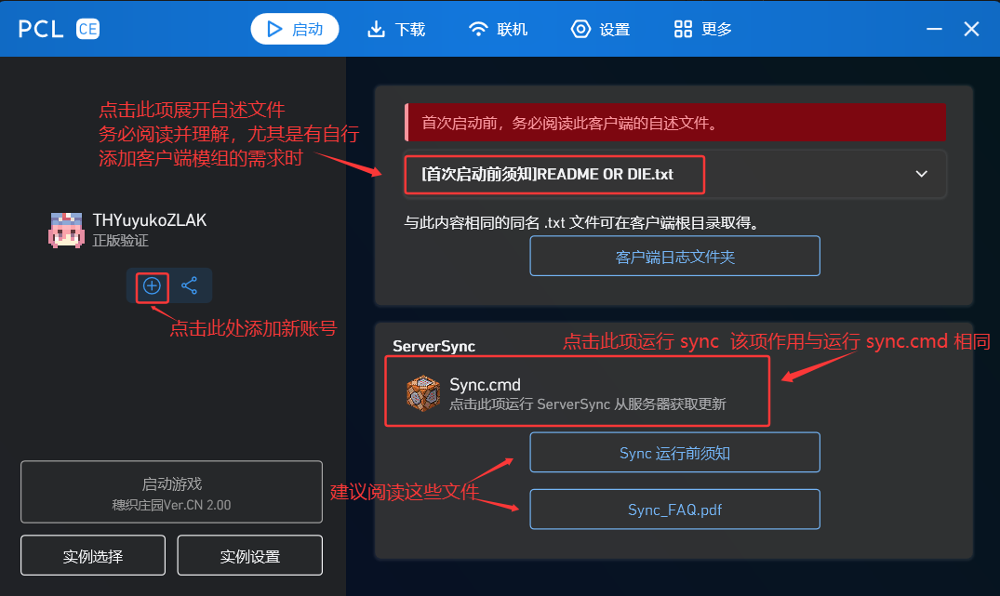
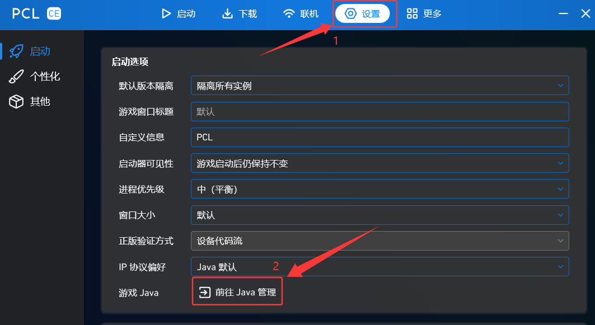
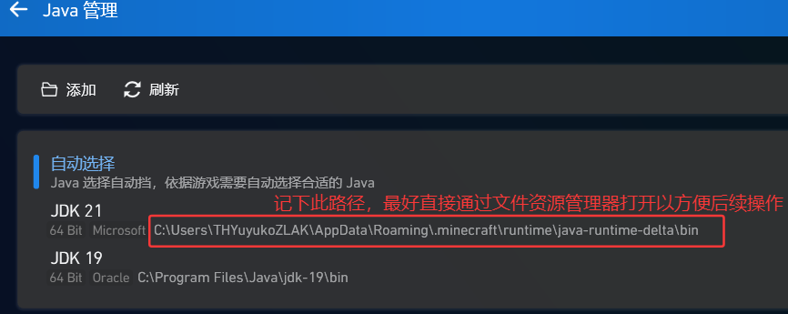
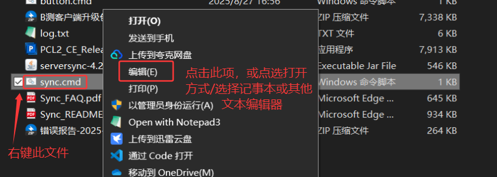
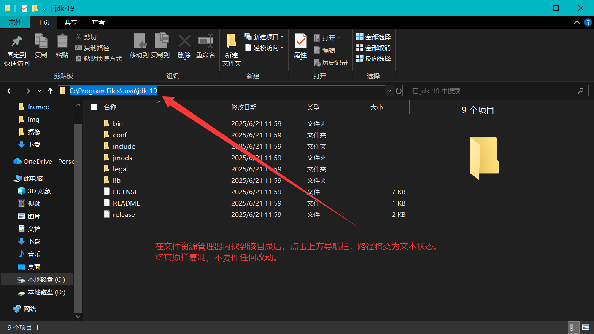

# 写在前面

> 不看文档用软件无异于盲人摸象  
不给日志修问题无异于闭眼开车

请**充分阅读并理解**此文档所属所有内容，该文档可解决绝大多数有关客户端的问题。  
如遇到该文档未涉及的问题并决定在群内提问，请：  
- 提供明确的问题和诉求描述  
- 提供**日志/崩溃报告/与问题有关的清晰截图**等材料（如有）  

不提供在手机上运行客户端相关的技术支持，如果必须要这么做，请自行解决出现的所有问题。

# stage 0  前期准备

确保运行客户端的计算机上有 java 运行环境（版本21及以上）。  
如果不知道什么是 java，请联系管理员获取相关文件与技术支持。  
如果曾在计算机上成功运行过 Minecraft 1.20.5 或以上版本，此部分可忽略。  

# stage 1  获取和使用客户端

## 获取客户端

在群文件获取已配置好的客户端包体：



获得压缩包后，将其解压至一个独立的空文件夹。  
解压后的内容应当如下：  

  

绝！对！不！要！直接双击压缩软件内目录运行其中的文件。务必**完整**解压客户端压缩包。  

## 运行 ServerSync

ServerSync（下称 sync）是一个独立于 Minecraft 本体的程序，通过与服务端通信完成客户端文件的更新。  
客户端第一次启动需要运行一次 sync。  

运行客户端根目录下的 `Sync.cmd` 启动该程序。  
若成功运行，将出现一个控制台窗口，并产生如下输出：

```
[1月 17, 2024 2:49:00][ServerSync] 信息: Root dir: C:\scex zen server ver2.0\.minecraft\versions\1.18.2-Forge_40.2.11
[1月 17, 2024 2:49:00][ServerSync] 信息: Running version: v4.2.0
[1月 17, 2024 2:49:00][ServerSync] 信息: Loading language file: zh_CN
[1月 17, 2024 2:49:00][ServerSync] 信息: < 正在连接服务器... >
```

此时程序将与服务端通信，并在稍后开始执行同步操作。  
等待出现 `按任意键继续。。。` 或 `Press any key to continue...` 时，表明同步操作已完成。此过程通常会持续约一分钟。  

如果没有出现如上输出，程序直接退出，说明 sync 没有正确运行，请转至下方`常见报错及解决方案/ServerSync 相关`并按步骤解决问题。  
务必确保 sync 正确运行一次再继续执行下述步骤。  

如果有自行添加客户端模组的需求，请阅读客户端附带的自述文件（见下）

## 启动游戏

运行 `PCL2_CE_Release_x64.exe` 打开启动器，会出现如下页面：



如有正版账号，可以登录。  
如没有正版账号，选择`离线登录`并输入希望在游戏中展示的 id。  
确保启动游戏按钮下的版本为`穗织庄园ver.CN 2.__`，点击启动游戏按钮运行游戏，并等待其加载完成。  
请确保计算机运行客户端时有 10 GiB 以上的内存空余。  

至此，客户端的首次启动配置完成。  

# stage 2  客户端游戏内配置相关

1.光影：  
光影设置页位于`esc菜单/选项/视频设置/光影包/`  
客户端已附带部分光影包，可按需启用。  
如需自行添加光影包，将其放置于客户端根目录下`.minecraft/versions/穗织庄园Ver.CN 2.00/shaderpacks`  
	
2.ysm模型：  
按`ctrl+y`打开ysm设置页  
如需在服务器使用自己的模型，联系管理员上传文件。  
	
3.flywheel：  
flywheel 是模组机械动力内置的渲染引擎，用于优化对机械动力添加的实体渲染性能。  
该功能在开启光影时会被禁用，需手动切换。  
若启用光影，在聊天栏执行命令 `/flywheel backend irisflw:instancing`  
若未启用光影但视野内存在机械动力相关方块时帧率有显著下降，执行命令 `/flywheel backend instancing`  
	
4.可选装的客户端模组：  
DistantHorizon：  
可极大地提升视距，但性能开销较大。  
安装后在`esc菜单/选项`页面，左上角视场角设置左侧的图标进入配置页面。  

目前仅提供上述模组，其他模组部分已预装与客户端内，默认启用。  
如有其他需求可通过启动器的下载功能自行添加。请注意处理模组兼容问题。  
所有选装的模组可在群文件`选配客户端模组`文件夹中寻得。  
将其移入`.minecraft/versions/穗织庄园Ver.CN 2.00/mods`中即生效。  

# 附录：常见报错及解决方案

## ServerSync 相关

运行 sync 时得到`'java'不是内部或外部命令，也不是可运行的程序或批处理文件。`的输出，此时 sync 因没有配置环境变量而无法运行。  

如果知道什么是环境变量，请为`java`命令配置环境变量。  
如果不知道什么是环境变量，按下述步骤进行：

找到安装在计算机的 java 路径，将其复制。  
通过启动器查找 java 路径的方法：  




回到客户端根目录，用任意文本打开sync.cmd:  



应当出现如下内容：

```cmd
@echo off
chcp 65001
cd .minecraft\versions\穗织庄园Ver.CN 2.00
java -jar ../../../serversync-4.2.0.jar --quiet
pause

```

对该文件作出以下修改：  
- 删除第四行开头的`java`  
- 找到在上文得到的 java 安装路径，将其复制  
- 将路径粘贴至`java`原先所在的地方，即第四行开头  
- 切换至英语输入法，用半角双引号`""`将复制进去的路径包围  
- 在该路径后添加`\bin\java.exe`



完成修改后的文件应当如下：

```cmd
@echo off
chcp 65001
cd .minecraft\versions\穗织庄园Ver.CN 2.00
"C:\Program Files\Java\jdk-19\bin\java.exe" -jar ../../../serversync-4.2.0.jar --quiet
pause
```

务必注意：严格按照上述步骤进行，不要照抄该示例！  
因计算机上已存在的 java 安装路径与版本可能与该示例不同，最终的修改内容会与本示例略有不同！  

保存文件，重新运行，应当能看见如 1.2 所示的正常输出。
